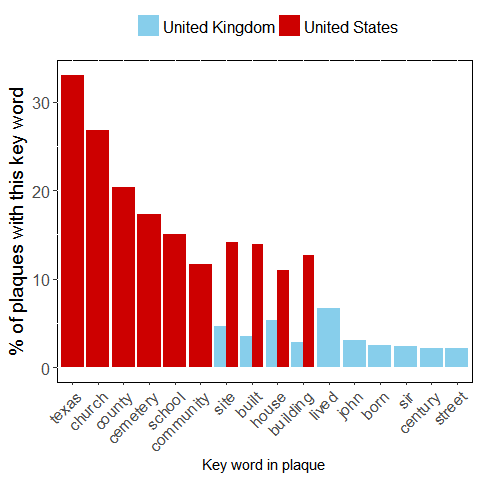

Figure1\_Plaques
================
Natalie Morse
April 30, 2018

``` r
# load data
data.plaque = read.csv("open-plaques-all-2018-04-08.csv")
colnames(data.plaque)[1] = "id"
data.plaque2 = data.plaque[1:200, ]
data.plaque[, c(4, 23)] = lapply(data.plaque[, c(4, 23)], as.character)

data.usuk = subset(data.plaque, country %in% c("United Kingdom", "United States"))
nrow(data.usuk)/nrow(data.plaque)  #percent of plaques in us or UK
```

    ## [1] 0.7282431

``` r
# Tokenise text variables for analysis
text.inscription = data_frame(inscription = data.usuk$inscription, id = data.usuk$id)
text.name = data_frame(name = data.usuk$lead_subject_name, id = data.usuk$id)

# Use unnest_tokens to make each row 1 word (it keeps the ECR # as ID to
# link them). Also remove stop words (the, of, etc.)
data("stop_words")
text.inscription = text.inscription %>% unnest_tokens(word, inscription) %>% 
    anti_join(stop_words)  #word is the new column that will have 1 word per entry, problem is the original data column it is pulling from
```

``` r
# Find most common word within plaque inscription within the US or UK
id.us = data.usuk$id[data.usuk$country == "United States"]
id.uk = data.usuk$id[data.usuk$country == "United Kingdom"]
text.insc.us = subset(text.inscription, id %in% id.us)
text.insc.uk = subset(text.inscription, id %in% id.uk)

text.inscription = merge(text.inscription, data.plaque[, c("id", "country")], 
    by = "id")

sum.ins = text.inscription %>% group_by(country) %>% count(word, sort = TRUE) %>% 
    mutate(., percent = n/length(unique(data.plaque$id)) * 100) %>% top_n(n = 10)
```

``` r
# plot most common words within plaque for US and UK

ggplot(aes(x = reorder(word, -n), y = percent, fill = country), data = sum.ins) + 
    geom_bar(stat = "identity", position = "dodge") + ylab("% of plaques with this key word") + 
    xlab("Key word in plaque") + theme(legend.position = "top", legend.text = element_text(size = 12), 
    axis.text.x = element_text(size = 12, angle = 45, hjust = 1), axis.text.y = element_text(size = 12), 
    axis.title.y = element_text(size = 14), strip.text.x = element_text(size = 16), 
    panel.background = element_rect(fill = "white", colour = "black"), legend.key = element_blank()) + 
    scale_fill_manual(values = c("skyblue", "red3"), name = "")
```



``` r
plt.std = theme(legend.position = "top", legend.text = element_text(size = 12), 
    axis.text.x = element_text(size = 12), axis.text.y = element_text(size = 12), 
    axis.title.y = element_text(size = 14), strip.text.x = element_text(size = 16), 
    panel.background = element_rect(fill = "white", colour = "black"), legend.key = element_blank())
```
